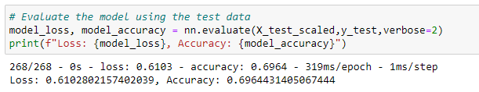

# Neural Network Charity Analysis

## Overview of Project

Using Machine Learning and Neural Networks for this project, I used the features in the dataset to create a binary classifier that will help to predict if the applicants that will be funded by a Charitable organization called Alphabet Soup will be successful. For this analysis we had a dataset containing various measures on 34,000 organizations that have been funded by Alphabet Soup. This project compromised of the following 3 steps: 
- Preprocessing the data for the neural network.
- Compile, Train and Evaluate the Model.
- Optimizing the model.

## Results 

### Data Preprocessing 
- Variable that was considered as the target for my model: IS_SUCCESSFUL Column.
- Variables that were considered features for my model: Every Column except for IS_SUCCESSFUL which is our target and the ones we will drop.
- Variable that were neither targets or features for the dataset: Columns that I dropeed are EIN, NAME because they will have little to no impact om our outcome.

### Compiling, Training and Evaluating the Model

The number of neurons, layers, and activation functions I selected for my neural network model:
- For my neural network model I had 2 hidden layers. My first layer had 80 neurons, the second has 30 there is also an output layer. The first and second hidden layer have the "relu" activation function and the activation function for the output layer is "sigmoid."

Was the model able to achieve the target model performance?
- The model was not able to reach the target 75%. The accuracy for my model was 50%

The steps taken to try and increase model performance

- Attempt 1: Removed additional feature, that is the 'USE_CASE' column. Rest of the model components stayed the same, the model accuracy went up to 69%

-  Attempt 2: Adding Additional neurons to hidden layers and additional hidden layers are added. The accuracy went down again, this time it was 55%.

- Attempt 3: Changing activation function of output layer from "sigmoid" to "tanh." The accuracy of the model went down even more to 47%.

## Summary 

The model ended up with an averagre accuracy score of 57% after optimization, with a scor of 69% being the highest at attempt 1 of the optimization. The initial neural network had a accuracy score of 50%. We could further also optimize our neural network by removing more features or simply adding more data to the dataset to increase accuracy.
Since our accuracy score was not particularly up to the standard, we could have also used the Random Forest classifiers. This is because random forest is a robust and accurate model due to their sufficient number of estimators and tree depth. Also the random forest models have a faster performance than neural networks and could have avoided the data from being overfitted.